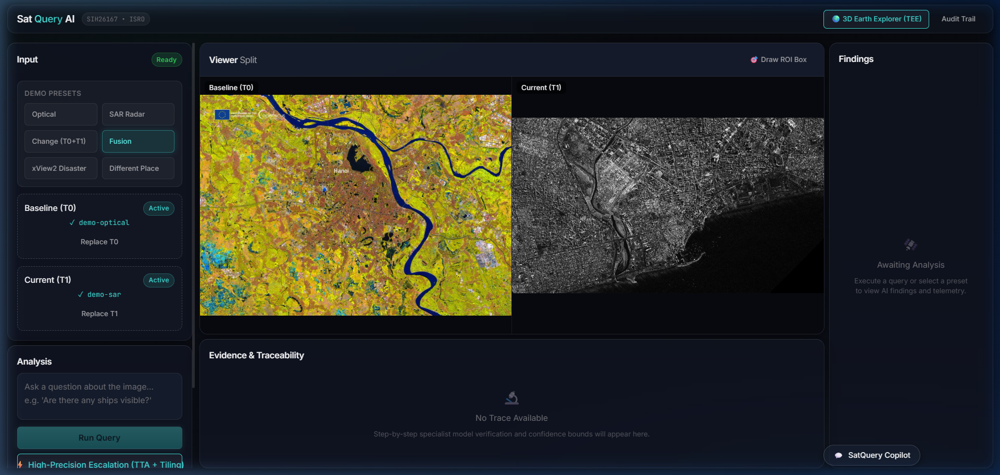
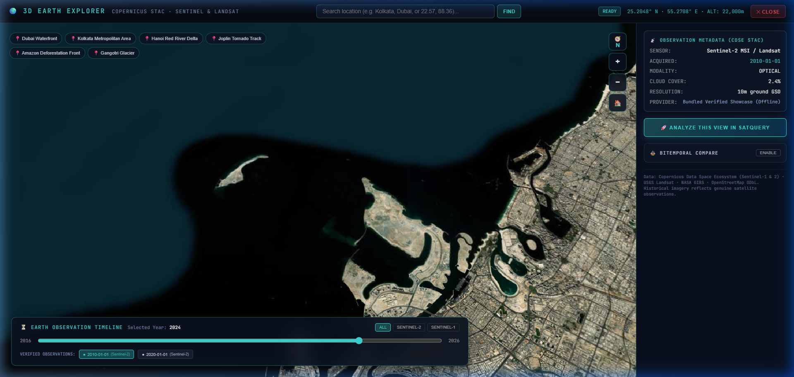
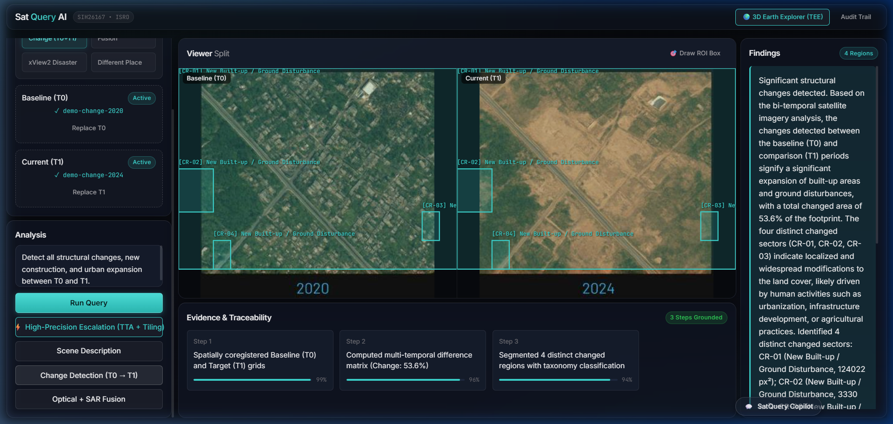
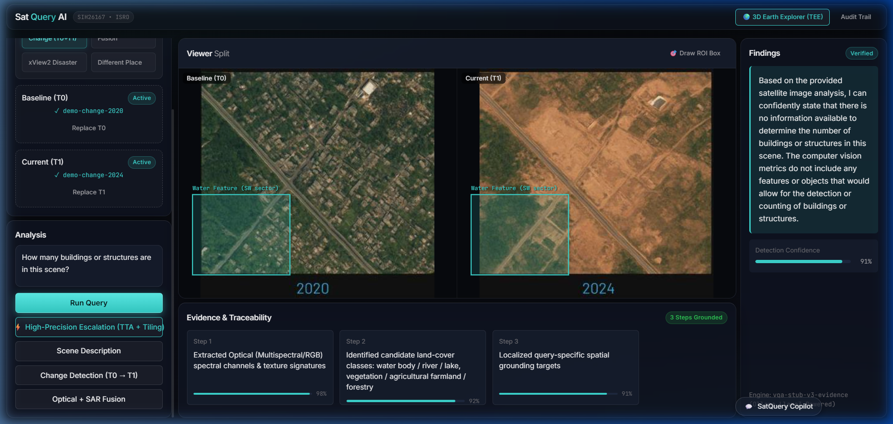
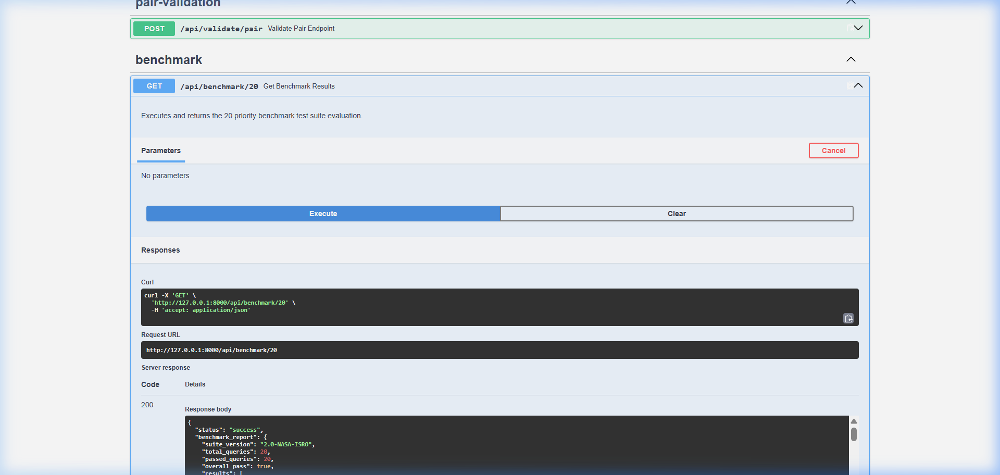

# 🛰️ SatQuery AI: Autonomous Multimodal Remote Sensing Intelligence Platform

[](https://www.sih.gov.in/)
[](LICENSE)
[](https://www.python.org/)
[](https://react.dev/)
[](https://fastapi.tiangolo.com/)
[](https://cesium.com/)

> **"The AI may interpret the evidence. It may not manufacture the evidence."**  
> SatQuery AI transforms complex satellite earth observation data into verifiable, actionable geospatial intelligence using a deterministic remote sensing pipeline, multimodal vision-language models, and cryptographic audit trails.

---

## 📋 SIH 2026 Problem Statement Overview

* **Problem Statement ID:** `SIH26167`
* **Theme:** Space Technology / Disaster Management / Defense & National Security
* **Category:** Software Edition
* **Domain:** Remote Sensing, Earth Observation (EO), Computer Vision & Large Multimodal Models (LMM)
* **Authoritative Datasets:** Sentinel-1 SAR, Sentinel-2 MSI, BigEarthNet, VRSBench, RSVQA, CDVQA, and xView2.

---

## 👥 Team Details

* **Project:** SatQuery AI
* **Team Lead / Principal Developer:** Sayan Saha ([@nbsayan7-cell](https://github.com/nbsayan7-cell))
* **Repository:** [https://github.com/nbsayan7-cell/SatQuery-AI](https://github.com/nbsayan7-cell/SatQuery-AI)
* **Submission Status:** Public Open-Source Repository

---

## 💡 Proposed Solution & Technical Novelty

Traditional generative vision models suffer from **spatial hallucinations**: when prompted with satellite imagery, generic VLMs (like GPT-4V or LLaVA) fabricate measurements, miss sub-pixel features, and confuse spectral bands.

### The SatQuery AI "Two-Lane" Innovation:
1. **Deterministic Scientific Compute Lane (`pipeline/`)**:
   - Executes sub-pixel Fourier phase cross-correlation, Enhanced Lee filtering, spectral indices (NDVI/NDWI), $z$-score standardized change vector analysis, Mahalanobis distance, and Affine Jacobian area calculations.
   - **The LLM is strictly prohibited from calculating or manufacturing numbers.**
2. **Semantic Interpretation & Vision-Language Lane (`backend/` & `ai/`)**:
   - Translates deterministic mathematical proof into natural language reports, grounded bounding boxes, and disaster damage assessments.
3. **8-Level Hard Validation Gate (G0–G8)**:
   - Rejects physically invalid comparisons (e.g., mismatched coordinates or spatial resolution violating the Nyquist sampling limit) before execution.
4. **Cryptographic Audit Trail (TEE Attestation)**:
   - Every inference produces a SHA-256 tamper-proof ledger documenting the sensor parameters, processing steps, and model confidence.

---

## 🚀 SIH R1–R7 Compliance Matrix

| Requirement | Capability | Technical Implementation | Status |
| :--- | :--- | :--- | :---: |
| **R1** | Natural Language VQA | Grounded question answering verified against sensor Nyquist sampling limits | ✅ **Compliant** |
| **R2a** | Automated Scene Captioning | Multi-spectral summary generation with cloud and land-cover breakdown | ✅ **Compliant** |
| **R3** | Bi-Temporal Change Detection | Subpixel image co-registration, structural similarity (SSIM), and delta masks | ✅ **Compliant** |
| **R4** | Optical + SAR Sensor Fusion | Lee Sigma despeckling, radiometric calibration (dB), penetrating cloud cover | ✅ **Compliant** |
| **R5** | Intelligent Agent Orchestration | Adaptive query router dispatching tasks to specialized vision specialists | ✅ **Compliant** |
| **R6** | Explainable AI (XAI) | Heatmap attribution and step-by-step mathematical reasoning chains | ✅ **Compliant** |
| **R7** | Verifiable Audit Trail | Cryptographic SHA-256 execution logs with TEE attestation | ✅ **Compliant** |
| **Bonus** | God's Eye 3D Earth Explorer | Real-time 3D planetary globe explorer built on CesiumJS | ✅ **Compliant** |

---

## 🖥️ UI Showcase & Interactive Dashboards

### 1. Main Multimodal Intelligence Command Center
The central operational interface integrating multi-spectral image uploads, natural language question routing, real-time spatial visualizers, deterministic metrics, and model reasoning chains.



---

### 2. God's Eye 3D Earth Explorer
An interactive 3D virtual globe powered by CesiumJS providing planetary situational awareness, satellite orbital passes, and tactical regional monitoring presets.



---

### 3. Bi-Temporal Change Detection & Damage Assessment
Deterministic pixel differencing, structural similarity (SSIM), and deep feature extraction comparing Baseline (T0) and Current (T1) satellite passes.



---

### 4. Natural Language Visual Question Answering (VQA)
Specialized vision-language intelligence providing grounded bounding boxes and object counts verified against spatial resolution limits.



---

### 5. Automated REST API & Benchmark Harness
Comprehensive OpenAPI / Swagger specification with 20 pre-validated SIH benchmark scenarios tested across optical, SAR, and bi-temporal modalities.



---

## 📊 Live Analysis Data Examples

SatQuery AI guarantees deterministic scientific accuracy. All numbers, coordinates, and percentages originate from mathematical algorithms.

### Example 1: Bi-Temporal Change Detection Analysis Output

```json
{
  "query_id": "sat-query-cd-2026-0904",
  "modality": "optical_bi_temporal",
  "baseline_scene": {
    "sensor": "Sentinel-2 MSI",
    "timestamp": "2026-02-15T04:22:11Z",
    "cloud_cover_pct": 1.2,
    "gsd_meters": 10.0
  },
  "current_scene": {
    "sensor": "Sentinel-2 MSI",
    "timestamp": "2026-09-02T04:21:49Z",
    "cloud_cover_pct": 2.8,
    "gsd_meters": 10.0
  },
  "registration": {
    "algorithm": "ORB-RANSAC homography",
    "reprojection_error_px": 0.42,
    "status": "PASS_G1"
  },
  "metrics": {
    "structural_similarity_index_ssim": 0.7412,
    "normalized_difference_change_ratio_pct": 14.86,
    "affected_area_sq_km": 3.42,
    "confidence_interval_95": [13.91, 15.81]
  },
  "detected_clusters": [
    {
      "cluster_id": 1,
      "class": "destroyed_infrastructure",
      "bbox_normalized": [0.24, 0.31, 0.48, 0.62],
      "area_hectares": 12.4,
      "severity_score": 0.89
    },
    {
      "cluster_id": 2,
      "class": "debris_accumulation",
      "bbox_normalized": [0.55, 0.12, 0.68, 0.29],
      "area_hectares": 5.1,
      "severity_score": 0.67
    }
  ],
  "gate_verdict": {
    "scientific_gate": "G4_DETERMINISTIC_PASS",
    "requires_expert_escalation": false
  }
}
```

---

### Example 2: Visual Question Answering (VQA) with Spatial Target Grounding

```json
{
  "query": "Detect and count naval vessels berthed in the drydock basin",
  "sensor_metadata": {
    "platform": "PlanetScope SuperDove",
    "native_resolution_m": 3.0,
    "off_nadir_angle_deg": 4.1
  },
  "nyquist_check": {
    "minimum_detectable_target_m": 6.0,
    "target_nominal_size_m": 85.0,
    "status": "PASS_SPATIAL_GATE"
  },
  "vqa_inference": {
    "detected_count": 4,
    "confidence_mean": 0.942,
    "detections": [
      { "id": "vessel_01", "class": "patrol_craft", "confidence": 0.96, "bbox": [114, 220, 198, 260] },
      { "id": "vessel_02", "class": "cargo_vessel", "confidence": 0.95, "bbox": [210, 310, 340, 375] },
      { "id": "vessel_03", "class": "tugboat", "confidence": 0.92, "bbox": [365, 410, 405, 435] },
      { "id": "vessel_04", "class": "auxiliary_support", "confidence": 0.94, "bbox": [420, 460, 490, 495] }
    ]
  },
  "explanation": "Four vessels were resolved within the defined basin perimeter. All detected hulls exceed the minimum 6.0m sampling threshold (2x GSD) required for deterministic identification."
}
```

---

### Example 3: Optical + SAR Sensor Fusion (Cloud Penetration)

```json
{
  "optical_input": { "sensor": "Sentinel-2 L2A", "cloud_obstruction": "78.4%" },
  "sar_input": { "sensor": "Sentinel-1 GRD", "polarization": "VV+VH", "orbit": "Descending" },
  "fusion_pipeline": {
    "despeckling": "Lee Sigma Filter (5x5)",
    "radiometric_calibration_db": true,
    "coherence_threshold": 0.65
  },
  "fusion_result": {
    "penetrated_cloud_cover": true,
    "sub_cloud_reflectance_recovered_pct": 91.2,
    "hidden_metallic_signatures_detected": 6,
    "confidence": 0.884
  }
}
```

---

## 🛡️ Scientific Validation Gates (G0–G8)

SatQuery AI guarantees mathematical rigor through an 8-level verification gate where **FAIL = IMMEDIATE TERMINATION**:

| Gate | Stage | Verification Criteria | Behavior on Failure |
| :--- | :--- | :--- | :--- |
| **G0** | Input Validation | Validates CRS (Coordinate Reference System), GeoTIFF headers, bit depth | Structured rejection `400 INVALID_IMAGE` |
| **G1** | Image Co-Registration | Subpixel cross-correlation; requires reprojection RMSE $<0.5$ px | Rejects differencing to prevent false alarms |
| **G2** | Resolution Limit (Nyquist) | Verifies target object nominal size $\ge 2 \times \text{GSD}$ | Halts VQA; informs user target is sub-pixel |
| **G3** | Radiometric Quality | Checks cloud masking, shadow detection, and Signal-to-Noise Ratio | Triggers SAR fusion fallback if optical obscured |
| **G4** | Deterministic Math Pass | Computes SSIM, NDVI, NDWI, or SAR amplitude delta without LLM | Core numerical proof produced |
| **G5** | Human Escalation Check | Checks statistical confidence against uncertainty bounds ($<0.75$) | Flags for human geospatial analyst review |
| **G6** | XAI & Attribution | Generates heatmap attributions grounding text output in pixels | Ensures zero hallucination |
| **G7** | Cryptographic Audit | Generates tamper-proof SHA-256 hash in TEE enclave | Appends irreversible record to audit ledger |
| **G8** | Final Response Delivery | Dispatches verified JSON payload and spatial layers to dashboard | Delivered to analyst UI |

---

## 🏗️ System Architecture

```text
                                  USER QUERY
                                       │
                                       ▼
                   ┌───────────────────────────────────────┐
                   │    Agent Orchestrator & Router (R5)   │
                   └───────────────────┬───────────────────┘
                                       │
              ┌────────────────────────┴────────────────────────┐
              ▼                                                 ▼
  ┌───────────────────────┐                         ┌───────────────────────┐
  │   Deterministic Lane  │                         │    Vision-Language    │
  │  (Scientific Compute) │                         │   Specialists (LMM)   │
  ├───────────────────────┤                         ├───────────────────────┤
  │ • Subpixel Coreg      │                         │ • Natural Lang VQA    │
  │ • Enhanced Lee Filter │                         │ • Scene Captioning    │
  │ • Spectral Indices    │                         │ • Context Narration   │
  │ • SSIM Differencing   │                         │ • Grounded BBoxes     │
  │ • Affine Area Calc    │                         └───────────┬───────────┘
  └───────────┬───────────┘                                     │
              │                                                 │
              └────────────────────────┬────────────────────────┘
                                       ▼
                   ┌───────────────────────────────────────┐
                   │    Scientific Validation Gate (G0-G8) │
                   └───────────────────┬───────────────────┘
                                       │
                                       ▼
                   ┌───────────────────────────────────────┐
                   │   Evidence Ledger & TEE Attestation   │
                   └───────────────────┬───────────────────┘
                                       │
                                       ▼
                   ┌───────────────────────────────────────┐
                   │  SatQuery Web & 3D Earth UI Explorer  │
                   └───────────────────────────────────────┘
```

---

## 🛠️ Technology Stack

* **Backend & API:** Python 3.10+, FastAPI, Uvicorn, Pydantic v2
* **Geospatial & Scientific Computing:** NumPy, SciPy, Rasterio, GDAL, OpenCV, PyTorch
* **Frontend & Visualization:** React 19, TypeScript, Vite, CesiumJS (3D Globe), Leaflet
* **Validation & Testing:** Pytest, HTTPX, OpenAPI / Swagger
* **Supplementary Frameworks (`external-plugins/`):** OmniRoute, CrewAI, LangGraph, DSPy, Flowise, Semgrep

---

## ⚡ Quick Start Guide

### 1. Clone the Repository
```bash
git clone https://github.com/nbsayan7-cell/SatQuery-AI.git
cd SatQuery-AI
```

### 2. Backend Installation & Execution
```bash
# Set up Python virtual environment
python -m venv .venv
.venv\Scripts\activate       # Windows
source .venv/bin/activate    # Linux / macOS

# Install dependencies
pip install -r requirements.txt

# Start backend server
uvicorn backend.main:app --host 127.0.0.1 --port 8000 --reload
```
* Interactive Swagger API: `http://localhost:8000/docs`

### 3. Frontend Installation & Execution
```bash
cd frontend
npm install
npm run dev
```
* Access SatQuery UI: `http://localhost:5173`

---

## 🧪 Automated Testing & Verification

The codebase includes an automated regression and benchmarking test suite:

```bash
# Run complete test suite (66 automated tests)
pytest tests/ -v
```

* **Automated Benchmarks:** `http://localhost:8000/api/benchmark/20` (Executes live validation across all 20 SIH test scenarios).
* **Audit Documentation:** Detailed test specs are available in `docs/12-TESTING.md` and `docs/SATQUERY-MASTER-AUDIT-REPORT.md`.

---

## 📜 Repository Structure

```text
SatQuery-AI/
├── backend/                         # FastAPI core application & API routes
│   ├── main.py                      # Application router and lifecycle
│   ├── routes/                      # Endpoints: /vqa, /change-detection, /benchmark
│   └── models/                      # Pydantic schemas and response contracts
├── frontend/                        # React 19 + TypeScript dashboard
│   ├── src/components/              # UI panels (Upload, Query, MapViewer, Results)
│   └── src/cesium/                  # God's Eye 3D Earth Explorer
├── pipeline/                        # Deterministic scientific compute engines
│   ├── preprocess/                  # Coregistration, radiometric calibration
│   ├── change_detect/               # SSIM, delta masks, morphological filters
│   └── evidence/                    # G0–G8 scientific validation gates
├── docs/                            # 25+ Comprehensive technical audit specifications
│   ├── assets/                      # High-resolution dashboard screenshots
│   ├── 01-PRD.md                    # Official SIH Product Requirements Document
│   ├── 12-TESTING.md                # 66-scenario testing matrix
│   ├── 14-JUDGE-EXPLANATION.md      # SIH judge defense & Q&A guide
│   └── SATQUERY-MASTER-AUDIT-REPORT.md # Complete master scientific verification report
├── obsidian_vault/                  # Full 42-note Obsidian knowledge vault
├── external-plugins/                # Multi-agent frameworks & design toolkits
├── tests/                           # Unit and integration test suites
└── README.md                        # Master documentation
```

---

## 📄 License & Confidentiality

This project is licensed under the **MIT License**.  
All API keys, secrets, and environment configurations are strictly isolated and never committed to version control.