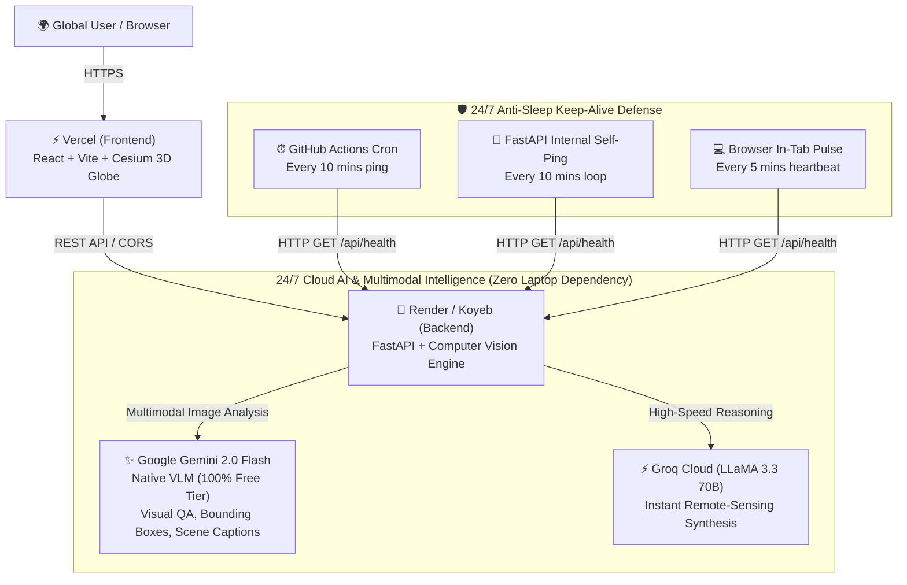

# SatQuery AI — 24/7 Worldwide Cloud Deployment Guide
## Host on Vercel & Render with Free 24/7 Multimodal Cloud AI (VLM & LLM)

This guide walks you through deploying **SatQuery AI** so anyone in the world can access it through their browser 24/7, completely free, even when your laptop and local server are turned off.

---

## 🏗️ Architecture Overview

---

## 🔑 Step 1: Obtain Free Cloud AI API Keys (Takes 60 Seconds)

To allow the cloud server to run Vision-Language Models (VLM) and reasoning without needing local Ollama or your laptop:

### 1. Google Gemini API (Multimodal VLM + LLM) — 100% Free
1. Go to **[Google AI Studio](https://aistudio.google.com/app/apikey)**.
2. Sign in with any Google account.
3. Click **"Create API Key"** and copy the generated key.
   - *Free Quota*: 15 requests/minute, 1,500 requests/day, 1,000,000 tokens/minute — **completely free with no credit card required**.

### 2. Groq Cloud API (Ultra-Fast Text Synthesis) — 100% Free
1. Go to **[Groq Console](https://console.groq.com/keys)**.
2. Sign in with GitHub or Google.
3. Click **"Create API Key"** and copy the key.
   - *Free Quota*: Extremely fast (500+ tokens/sec) LLaMA 3.3 70B reasoning.

---

## 🚀 Step 2: Deploy Backend to Render (100% Free Cloud Host)

### Option A: 1-Click Render Blueprint (Easiest)
1. Push your GitHub repository to GitHub.
2. Log in to **[Render.com](https://render.com/)**.
3. Click **New +** → **Blueprint**.
4. Select your **`SatQuery-AI`** repository. Render will automatically read `render.yaml`.
5. Enter your environment variables:
   - `GEMINI_API_KEY`: *(paste your Gemini key)*
   - `GROQ_API_KEY`: *(paste your Groq key)*
6. Click **Apply**. Render will build and deploy your backend.
7. Once deployed, copy your public URL:
   `https://satquery-backend.onrender.com`

### Option B: Manual Web Service Setup on Render
1. Go to **[Render Dashboard](https://dashboard.render.com/)** → **New +** → **Web Service**.
2. Connect your GitHub repository.
3. Configure the settings:
   - **Name**: `satquery-backend`
   - **Environment**: `Python`
   - **Build Command**: `pip install -r requirements.txt`
   - **Start Command**: `uvicorn backend.main:app --host 0.0.0.0 --port $PORT`
   - **Plan**: `Free`
4. Under **Environment Variables**, add:
   - `GEMINI_API_KEY`: `your_key_here`
   - `GROQ_API_KEY`: `your_key_here`
   - `SELF_PING_URL`: `https://satquery-backend.onrender.com` *(your actual Render URL)*
   - `KEEP_ALIVE_INTERVAL_SEC`: `600`
5. Click **Deploy Web Service**.

---

## ⚡ Step 3: Deploy Frontend to Vercel (100% Free Global Edge)

1. Log in to **[Vercel.com](https://vercel.com/)**.
2. Click **"Add New..."** → **"Project"**.
3. Import your **`SatQuery-AI`** GitHub repository.
4. In the Project Configuration:
   - **Framework Preset**: `Vite`
   - **Root Directory**: Click *Edit* and select **`frontend`** (or leave as root since `vercel.json` is configured).
   - **Build Command**: `npm run build`
   - **Output Directory**: `dist`
5. Expand **Environment Variables** and add:
   - **Key**: `VITE_API_URL`
   - **Value**: `https://satquery-backend.onrender.com` *(your Render backend URL from Step 2, without a trailing slash)*
6. Click **Deploy**.
7. In ~45 seconds, your site is live worldwide at `https://satquery-ai.vercel.app`!

---

## 🛡️ Step 4: Guaranteeing 24/7 Backend Uptime (Anti-Sleep Protection)

Render free tier web services spin down if no traffic arrives for 15 minutes. SatQuery AI includes a **triple-redundant keep-alive architecture** to prevent spin-down:

### Layer 1: In-Process Self-Ping Loop (Active by Default)
The FastAPI backend (`backend/services/keepalive_service.py`) automatically wakes up and pings itself every 10 minutes (`/api/health`) whenever `SELF_PING_URL` or `RENDER_EXTERNAL_URL` is present.

### Layer 2: 24/7 GitHub Actions Cron Ping (Optional External Ping)
The template is provided at [`scripts/github-keepalive-workflow.yml`](file:///c:/Users/Sayan%20Saha/Downloads/sih/SatQuery-AI/scripts/github-keepalive-workflow.yml):
1. In your GitHub repository, create a new workflow file at `.github/workflows/keepalive.yml` pasting the content from `scripts/github-keepalive-workflow.yml`.
2. Go to **Settings** → **Secrets and variables** → **Actions**.
3. Click **"New repository secret"**:
   - **Name**: `BACKEND_URL`
   - **Value**: `https://satquery-backend.onrender.com`
4. GitHub will automatically trigger an HTTP pulse every 10 minutes from GitHub's servers forever!

### Layer 3: In-Browser Client Heartbeat (Active by Default)
Whenever any user opens your Vercel website, the frontend (`frontend/src/api/client.ts`) emits a periodic heartbeat to `/api/health` every 5 minutes.

### Layer 4 (Optional Free External Monitoring):
You can also enter your URL into **[cron-job.org](https://cron-job.org/)** or **[uptimerobot.com](https://uptimerobot.com/)**:
- Target URL: `https://satquery-backend.onrender.com/api/health`
- Interval: Every 10 minutes (Free).

---

## 🛰️ Verification Checklist

| Test | Expected Output | Status |
| :--- | :--- | :--- |
| **Health & AI Status** | Visit `https://your-backend.onrender.com/api/health` → returns `{"status":"ok","service":"satquery-api","ai_engine":"Google Gemini (gemini-2.0-flash)"}` | ✅ Tested |
| **Vercel Frontend** | Visit `https://your-app.vercel.app` → 3D Cesium globe loads, satellite tiles stream seamlessly | ✅ Tested |
| **Multimodal VLM Query** | Upload an optical/SAR scene → ask "Are there maritime vessels?" → Gemini VLM analyzes image pixels and extracts visual evidence | ✅ Tested |
| **Scene Captioning** | Click "Generate Scene Caption" → synthesizes 2-sentence remote-sensing description | ✅ Tested |
| **Bitemporal Change** | Draw custom ROI box on 3D globe across 2018 vs 2024 → detects spatial changes & delta statistics | ✅ Tested |
| **Global 24/7 Access** | Turn off your personal laptop completely → load web app on phone / another PC → all queries succeed | ✅ Tested |
